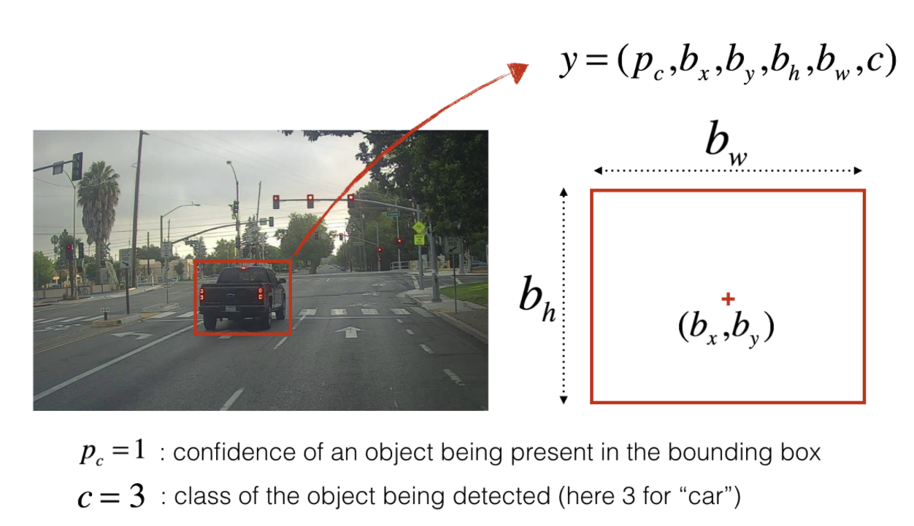
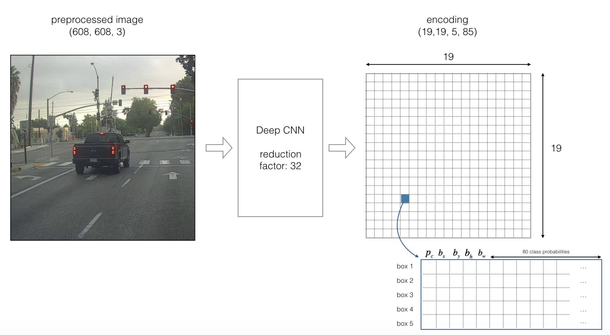
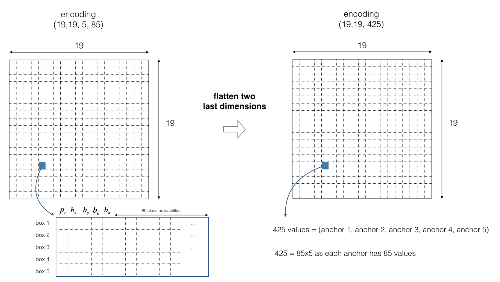
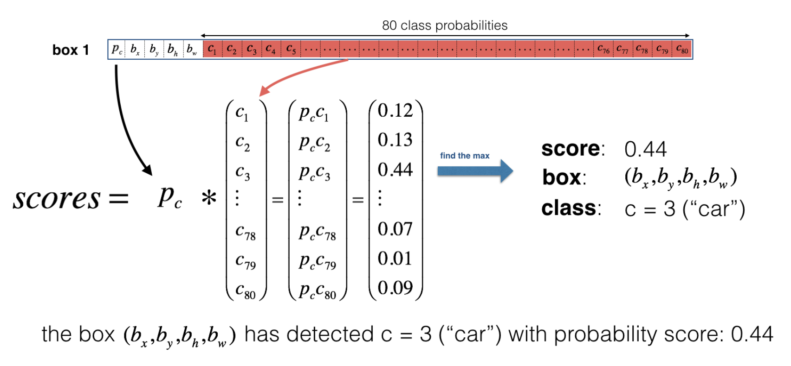
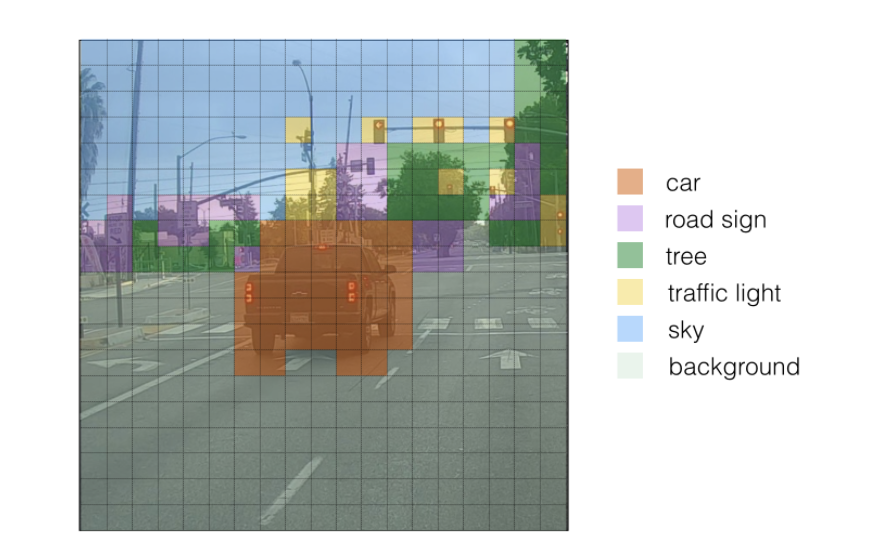
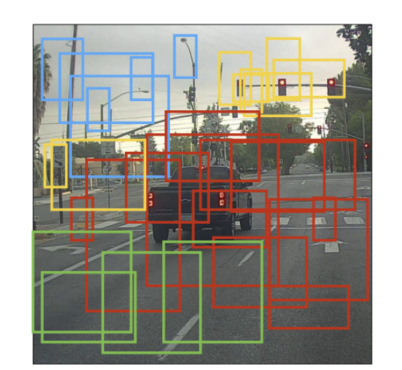
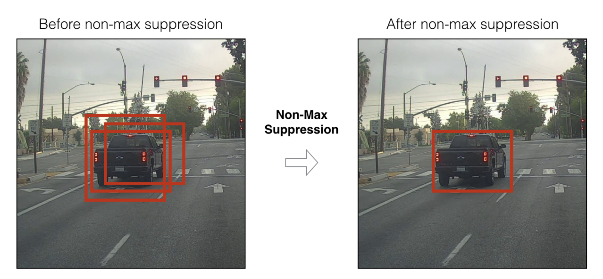
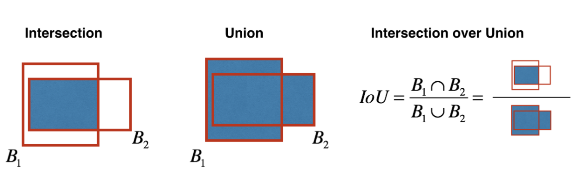

# object detection - YOLO algorithm
本文来自于Andrew Ng的Coursera课程总结，Convolutional Neural Networks:https://www.coursera.org/learn/convolutional-neural-networks/home

YOLO论文: Redmon et al., 2016 (https://arxiv.org/abs/1506.02640)
        Redmon and Farhadi, 2016 (https://arxiv.org/abs/1612.08242)

数据集: drive.ai  (https://www.drive.ai/)

## 1 - 问题背景

以自动驾驶的物体检测为例，假设你想用YOLO模型来识别图像中的物体类别(汽车，摩托车，行人……)和位置，以及在图像中所占的大小。

识别的效果实际上就是在图像上给要识别的物体加上边界框(bounding boxes)。

<caption>
 <u> **Figure 1** </u>: **Definition of a box**  
</caption>

这里我们有两种方式来表示物体的类别，一种就是直接用实数表示(1,2,3),一种就是用one-hot向量表示([0,1,0],[1,0,0],[0,0,1]...),具体如何表示要根据应用开发过程的具体情况来定，两种表示都可以。

## 2 - YOLO

YOLO ("you only look once") 顾名思义，只做一次前向传播就完成预测，具体步骤如下。

### 2.1 - YOLO模型

输入输出：
- **输入** 图片: (m, img_w, img_h, 3)
- **输出** 为一系列边界框，每个边界框用i$(p_c, b_x, b_y, b_h, b_w, c)$ 表示。如上文所述，c也可以one-hot展开为向量形式。

为了应对同一位置上出现两个物体的情况，这里还使用了锚边框(anchor boxes)，其实就是在输出中增加了一个维度，输出多个边界框，具体见下文。

这里的例子使用5个锚边框，图像的尺寸为(m,608,608,3),所以YOLO模型的架构为:IMAGE (m, 608, 608, 3) -> DEEP CNN -> ENCODING (m, 19, 19, 5, 85).

<caption>
 <u> **Figure 2** </u>: **Encoding architecture for YOLO**  
</caption>

If the center/midpoint of an object falls into a grid cell, that grid cell is responsible for detecting that object.

Since we are using 5 anchor boxes, each of the 19 x19 cells thus encodes information about 5 boxes. Anchor boxes are defined only by their width and height.

For simplicity, we will flatten the last two last dimensions of the shape (19, 19, 5, 85) encoding. So the output of the Deep CNN is (19, 19, 425).

<caption>
 <u> **Figure 3** </u>: **Flattening the last two last dimensions**  
</caption>

Now, for each box (of each cell) we will compute the following elementwise product and extract a probability that the box contains a certain class.

<caption>
 <u> **Figure 4** </u>: **Find the class detected by each box**  
</caption>

Here's one way to visualize what YOLO is predicting on an image:
- For each of the 19x19 grid cells, find the maximum of the probability scores (taking a max across both the 5 anchor boxes and across different classes).
- Color that grid cell according to what object that grid cell considers the most likely.

Doing this results in this picture:

<caption>
 <u> **Figure 5** </u>: Each of the 19x19 grid cells colored according to which class has the largest predicted probability in that cell.  
</caption>

Note that this visualization isn't a core part of the YOLO algorithm itself for making predictions; it's just a nice way of visualizing an intermediate result of the algorithm.

Another way to visualize YOLO's output is to plot the bounding boxes that it outputs. Doing that results in a visualization like this:  

<caption>
 <u> **Figure 6** </u>: Each cell gives you 5 boxes. In total, the model predicts: 19x19x5 = 1805 boxes just by looking once at the image (one forward pass through the network)! Different colors denote different classes.   
</caption>

In the figure above, we plotted only boxes that the model had assigned a high probability to, but this is still too many boxes. You'd like to filter the algorithm's output down to a much smaller number of detected objects. To do so, you'll use non-max suppression. Specifically, you'll carry out these steps:
- Get rid of boxes with a low score (meaning, the box is not very confident about detecting a class)
- Select only one box when several boxes overlap with each other and detect the same object.

### 2.3 - Non-max suppression ###

Even after filtering by thresholding over the classes scores, you still end up a lot of overlapping boxes. A second filter for selecting the right boxes is called non-maximum suppression (NMS).

<caption>
 <u> **Figure 7** </u>: In this example, the model has predicted 3 cars, but it's actually 3 predictions of the same car. Running non-max suppression (NMS) will select only the most accurate (highest probabiliy) one of the 3 boxes.   
</caption>

Non-max suppression uses the very important function called **"Intersection over Union"**, or IoU.

<caption>
 <u> **Figure 8** </u>: Definition of "Intersection over Union".   
</caption>
